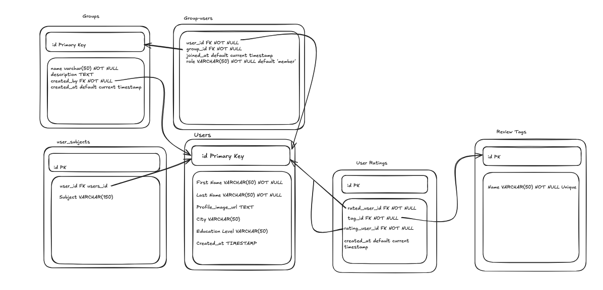
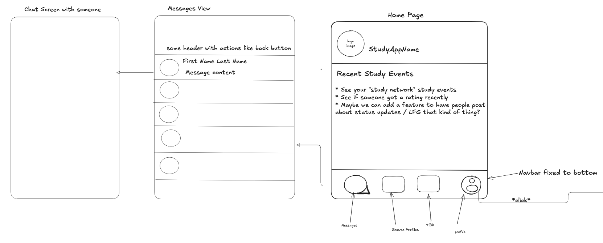
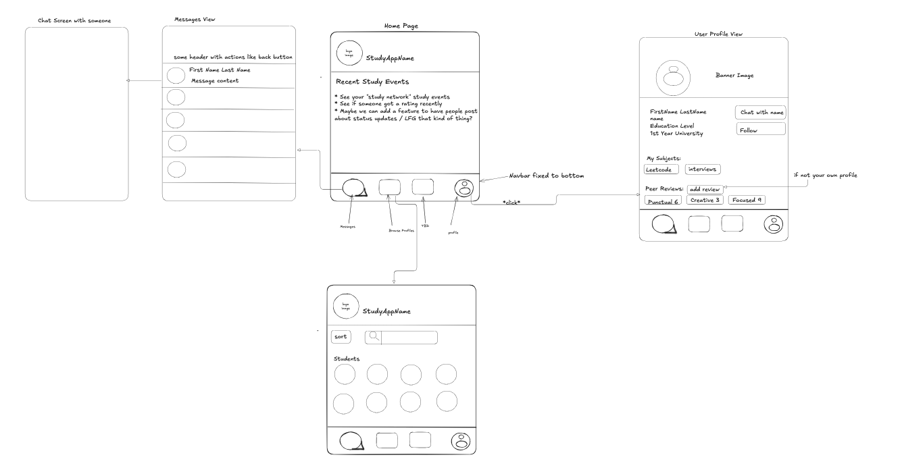

### Idea

#### Purpose

- Social app for students to find study partners with others with similar topics of study.

#### Value

- Students can build a network

- Can find a study partner of their similar level or similar pursuit
  - Even within a university degree - not all people will study for the same pursuit. Bachelor of Science, for example, can go so many ways - medicine, pharm, research, etc. Comp Sci - Devs, Data
- Sometimes studying with your friends can be not as productive.
- Accountability

#### MVP

- As a user, I can register and create a profile
- As a user, I can add subjects to my profile
- As a user, I can optionally add a grade/year
- As a user, I can optionally add my city (for those who want to meet up)
- As a user, I can see other’s profile information
- As a user, I can chat with another user
- As a user, I can rate another user’s productivity during a study session
- The rating system will be tag based as opposed to star based:
  - “Focused”
  - “Committed”
  - “Punctual”

#### Other Features

- As a user, I can create a group with tags like “MCAT”, “leetcode”, “mock interview”
- As a user, when I add a subject to my profile, I can opt into related groups.
- As an admin of a group, I can accept invitations, or remove users.
- As an admin, I can provide roles
- As a user with proper role access, I can create events or make announcements in the group.
- As a user with proper role access, you can upload files (for notes or meeting documentation).
- As a user, events that you attend (online or in person) will mark a day of completion (like a github commit map)

### Entity Relationship Diagram

- Questions to resolve:
  - does the type of the city and education level for the users table have to change if we're going to be putting a matching algorithm in the future?

### Front-End

- Site Map Home to Messages v1
  
- Site Map Profile and Browse v1
  
